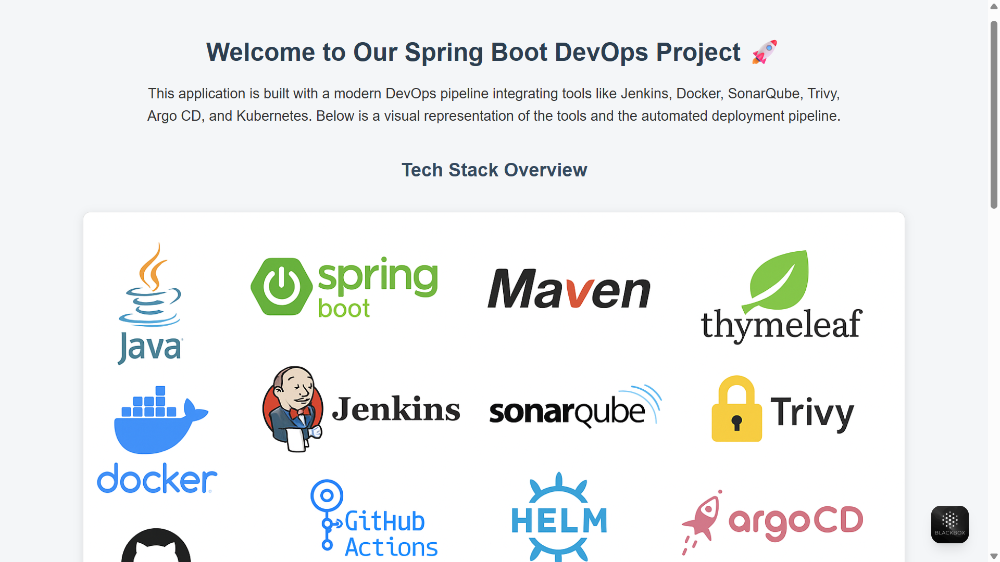

# CI/CD Pipeline for Spring Boot Microservice using Jenkins, Argo CD, Helm & Trivy on Kubernetes

This project implements a secure and automated CI/CD pipeline for a Spring Boot microservice. It includes:

* **Jenkins** for CI/CD orchestration
* **Docker** for containerization
* **SonarQube** for static code analysis
* **Trivy** for image vulnerability scanning
* **Argo CD** for GitOps deployment
* **Helm** for multi-container Kubernetes deployment
* **NGINX** for reverse proxy and browser routing
* **Kubernetes** (EKS-ready) as the deployment platform

### 🔁 Flow Summary

1. Developer commits code to GitHub.
2. Jenkins triggers build, test, scan, and image creation.
3. SonarQube checks code quality.
4. Trivy scans Docker image for vulnerabilities.
5. Docker image pushed to registry.
6. Argo CD pulls updated manifests and deploys to Kubernetes.
7. NGINX routes requests to `/app`, `/admin`, and `/reports`.
8. Users access the app via a browser.

> ✅ Final Output: Secure, production-grade Spring Boot app running on Kubernetes with full DevOps automation.

## Project Folder Architecture:
-------------------------------

```bash

Springboot-cicd-on-k8s
├── app/                             ← Spring Boot application
│   ├── src/
│   │   └── main/
│   │       ├── java/com/example/
│   │       │   ├── HelloJenkinsApplication.java   ← Main Spring Boot class
│   │       │   └── WebController.java            ← UI Controller
│   │       └── resources/
│   │           ├── static/
│   │           │   └── tech-stack.png             ← Tech stack image
│   │           ├── templates/
│   │           │   └── index.html                 ← HTML UI with message + image
│   │           └── application.properties         ← Spring config
│   ├── pom.xml                     ← Maven dependencies
│   └── Dockerfile                 ← Dockerize Spring Boot app
│
├── nginx/                           ← Nginx reverse proxy config & content
│   ├── Dockerfile                   ← : Builds image with embedded routes/reports
│   ├── default.conf                 ← Nginx routing config (/app, /admin, /reports)
│   ├── index.html                  ← Admin dashboard (HTML)
│   └── reports/
│       ├── trivy-report.txt         ← CLI scan report
│       ├── sonar-report.html        ← Optional HTML output
│       └── image-scan.json          ← Trivy JSON vulnerability output
│
├── jenkins/
│   ├── Jenkinsfile                 ← CI/CD pipeline (Build + Sonar + Trivy + Argo CD)
│   └── scan-trivy.sh              ← Shell script to scan image & fail on criticals
│
├── sonar/
│   └── sonar-project.properties    ← Sonar project config
│
├── manifests/                      ← Kubernetes YAML (manual deployment)
│   ├── deployment.yaml             ← Spring Boot K8s deployment
│   ├── service.yaml                ← NodePort/LoadBalancer access
│   └── nginx.yaml                  ← Nginx K8s deployment + service
│
├── jenkins-demo-chart/             ← Helm chart for Spring + Nginx
│   ├── Chart.yaml
│   ├── values.yaml
│   └── templates/
│       ├── spring-deployment.yaml
│       ├── spring-service.yaml
│       ├── nginx-deployment.yaml
│       ├── nginx-service.yaml
│       ├── configmap-nginx.yaml
│       └── ingress.yaml            ← Handles /app, /admin, /reports routing
│
├── .github/                        ← CI/CD workflows for Docker builds
│   └── workflows/
│       └── docker-nginx.yml        ← GitHub Actions: auto build/push Nginx
│
├── README.md                       ← Project overview, architecture, setup
├── .gitignore                      ← Ignore target/, logs, reports, secrets


### ASCII Art Version (For Quick Overview):
-------------------------------------------
```bash

+-------------------------------------------------------+
|       CONTINUOUS DELIVERY (JENKINS + HELM + ARGOCD)   |
+-------------------------------------------------------+
|                                                       |
|  JENKINS PIPELINE                                     |
|  ┌─────────┐  ┌─────────┐  ┌─────────┐  ┌─────────┐   |
|  │ BUILD   │→ │SONARQUBE│→ │ TRIVY   │→ │ ARGOCD  │   |
|  │ (Maven) │  │(Quality)│  │ (CVE)   │  │ (Deploy)│   |
|  └─────────┘  └─────────┘  └─────────┘  └─────────┘   |
|            ↓              ↓              ↓            |
|  ┌───────────────────────────────────────────────┐    |
|  │               QUALITY GATES                  │     |
|  │  - Sonar: Coverage ≥80%                      │     |
|  │  - Trivy: 0 Critical CVEs                    │     |
|  └───────────────────────────────────────────────┘    |
|                                                       |
+-------------------------------------------------------+
           ↓
+-------------------------------------------------------+
|               KUBERNETES CLUSTER                      |
|  ┌─────────────────┐        ┌─────────────────┐       |
|  │ SPRING BOOT POD │←──────→│ NGINX POD       │       |
|  │ (app:8080)      │ Ingress│ (admin/reports) │       |
|  └─────────────────┘        └─────────────────┘       |
+-------------------------------------------------------+


## TECH STACK:
   -----------
```bash  


┌───────────────────────────────────────────────────────────────────────----┐ 
│                           TECH STACK                                      │
├───────────────────┬───────────────────┬───────────────────┬────────────---┤
│    Backend        │    DevOps         │      CI/CD        │ Cloud Services│
├───────────────────┼───────────────────┼───────────────────┼────────────---|
│  • Java           │  • Docker         │  • GitHub         │  • AWS EC2    │
│  • Spring Boot    │  • Jenkins        │  • GitHub Actions │  • AWS EKS    │
│  • Maven          │  • SonarQube      │  • Helm           │               │
│  • Thymeleaf      │  • Trivy          │  • Argo CD        │               │
├───────────────────┴───────────────────┴───────────────────┴────────────---|
│                                                                           │
│  Platform & Infrastructure: Kubernetes, Nginx, Ingress                    │
│                                                                           |
└───────────────────────────────────────────────────────────────────────----┘

# Run an application on browser in local environment:
  ----------------------------------------------------
```bash

*Create an ec2 instance in AWS cloud
       >name   : Springboot-cicd-on-k8s
       >os     : ubuntu
       >instance: t2.large
       >key pair : Prometheus.pem
       >Network settings: port - 8080
*connect server through an ec2 instance via git bash
        >   chmod 400 "Prometheus.pem"  
        > ssh -i "Prometheus.pem" ubuntu@ec2-3-86-177-86.compute-1.amazonaws.com
*Clone the project repository from GitHub 
         > git clone <repository url></repository>
         > root@ip-172-31-95-129:~/Springboot-cicd-on-k8s/app# 
         > apt update -y
         > apt install maven -y
         > apt install openjdk-17-jdk -y
         > apt install docker.io -y
         > mvn clean package
         > java -jar target/jenkins-demo-1.0.0.jar
         >docker build -t jenkins-demo:latest .
         >docker run -d -p 8080:8080 --name springboot-app jenkins-demo:latest
#Successfully run an application on browser:


#Push this image to DockerHub:
>docker tag jenkins-demo:latest your-dockerhub-username/jenkins-demo:latest
docker push your-dockerhub-username/jenkins-demo:latest


# Trouble Shooting:
-------------------

#1)system has a conflicting Java environment:

🔍 Summary of current issue:
java is pointing to OpenJDK 21

javac (the Java compiler) is pointing to JDK 17

But your Maven build uses javac --release 17, and this mismatch can cause errors if javac and java are not aligned properly.

sudo update-alternatives --config java

/usr/lib/jvm/java-17-openjdk-amd64/bin/java

java -version
javac -version

openjdk version "17.0.x"
javac 17.0.x

 Then retry:

 mvn clean package

#2)app(Dockerfile):

>vi Springboot-cicd-on-k8s/app/Dockerfile

FROM openjdk:17-jdk-alpine
VOLUME /tmp
ARG JAR_FILE=target/jenkins-demo-1.0.0.jar
COPY ${JAR_FILE} app.jar
ENTRYPOINT ["java", "-jar", "/app.jar"]


>Build Docker image:
cd ~/Springboot-cicd-on-k8s/app
docker build -t jenkins-demo:latest .

>Run Docker Container:
docker run -d -p 8080:8080 --name springboot-app jenkins-demo:latest

#1.Stop all running containers:
 >docker stop $(docker ps -q)
#2.Remove all containers(both running and stopped):
>docker rm $(docker ps -aq)
#3. Do both in one step:
>docker rm -f $(docker ps -aq)
#4. Remove all unused Docker data(careful!):
>docker system prune -a
*This will remove:
.All stopped containers
.All unused images
.All unused networks
.All build cache
! Be cautious -- this will also delete images and dangling volumes.

#3.Rebuild and Restart the App:
-------------------------------
>root@ip-172-31-95-129:~/Springboot-cicd-on-k8s/app#

>mvn clean package
docker build -t jenkins-demo:latest .
docker stop springboot-app
docker rm springboot-app
docker run -d -p 8080:8080 --name springboot-app jenkins-demo:latest
>Check Browser Again
http://<your-ec2-ip>:8080

#4) File structure mismatch:
> We can see our folder or file structure install tree like the below:
 apt install tree

#5) Jenkins Install & Configure:
*root@ip-172-31-92-91:~/Springboot-cicd-on-k8s/app# cat /var/jenkins_home/secrets/initialAdminPassword 

*cat: /var/jenkins_home/secrets/initialAdminPassword: No such file or directory

docker ps

# If it's running, check inside the container:
docker exec -it <jenkins-container-id> /bin/bash

cat /var/jenkins_home/secrets/initialAdminPassword


# Implementation steps for Springboot-cicd-on-k8s:
-------------------------------------------------

```
# Step 1: Prepare the Environment
>Launch an AWS EC2 Ubuntu 24.04 instance

>Update & install dependencies:
```bash
sudo apt update && sudo apt upgrade -y
sudo apt install git docker.io docker-compose openjdk-17-jdk maven unzip curl -y
sudo usermod -aG docker $USER && newgrp docker

# Step 2: Clone Spring Boot App From GitHub

git clone https://github.com/your-username/Springboot-cicd-on-k8s.git
cd Springboot-cicd-on-k8s/app

#Step 3: Build the App JAR

mvn clean package
java -jar target/jenkins-demo-1.0.0.jar
#Step 4:Create Docker Image
>Dockerfile
FROM openjdk:17-jdk-alpine
VOLUME /tmp
ARG JAR_FILE=target/jenkins-demo-1.0.0.jar
COPY ${JAR_FILE} app.jar
ENTRYPOINT ["java", "-jar", "/app.jar"]
EXPOSE 8080

>Build Docker Image:
docker build -t jenkins-demo:latest .
docker run -d -p 8080:8080 --name springboot-app jenkins-demo:latest

Test in browser:
http://<EC2-IP>:8080

#Step 5: Install & Configure Jenkins

docker run -d -p 8081:8080 -p 50000:50000 --name jenkins \
  -v jenkins_home:/var/jenkins_home \
  -v /var/run/docker.sock:/var/run/docker.sock \
  jenkins/jenkins:lts

NOTE! : To free up port 8080, just kill that process:
> sudo kill -9 2453
Then verify it’s freed:
>sudo lsof -i :8080


docker exec -it <jenkins-container-id> /bin/bash

cat /var/jenkins_home/secrets/initialAdminPassword


*Setup Jenkins from http://<EC2-IP>:8081

* Install plugins: Git, Docker, Maven, BlueOcean, Kubernetes, etc.

* Add GitHub credentials, DockerHub credentials.

# Minimum Required Plugins Summary:
Here is the minimum plugin list for your project:

✅ Must-Have Plugins  
git server *
github *
Docker  *
Docker Pipeline *
Docker Commons *
maven integration-plugin *
SonarQube Scanner *
Sonar Quality Gates *
Kubernetes CLI *
Kubernetes Credentials *
ssh-agent *
ansicolor *
timestamper *
envinject *

>Stop and Start Jenkins like this,
docker stop jenkins
docker start jenkins

>After restart
>Wait for Jenkins to come back up (may take 10–60 seconds).

>Recheck with:

docker logs -f jenkins    # for Docker

# Method 1: Using docker-compose (Recommended for Projects)
------------------------------------------------------------
> Create a docker-compose.yml file and define all your containers there.
Note! : Creating a docker-compose.yml file for project *
> Start all containers at a time
* docker-compose up -d

> Restart all containers 
* docker-compose restart

> Stop all containers
* docker-compose down

# Method 2: Start multiple containers in one command
------------------------------------------------------
#If you're not using docker-compose, you can start them manually like this:
* docker start jenkins sonarqube nginx
>Start using container IDs
* docker start dbc41e3ecd34 4d994742849c

# Tip: o rename containers for easy use
docker rename flamboyant_wright jenkins
docker rename youthful_chatelet jenkins-demo


#Method 3: Use Docker run for multiple new containers
* docker run -d --name jenkins jenkins/jenkins:lts
docker run -d --name sonarqube sonarqube
docker run -d --name nginx nginx

>Each -d makes it run in background.

> Manually run SonarQube in docker
* docker run -d   --name sonarqube   -p 9000:9000   -e SONAR_ES_BOOTSTRAP_CHECKS_DISABLE=true   sonarqube:latest


>>> We are moving to Argo CD part, so we can follow the below URL links as per our requirement, Choose carefully our requirement is  Ubuntu (24.04 LTS) or Ubuntu (22.04 LTS),
   1. https://www.fosstechnix.com/install-argocd-on-minikube-with-ubuntu-24-04/
                             (or)
   2. https://www.fosstechnix.com/how-to-install-argocd-on-minikube/
